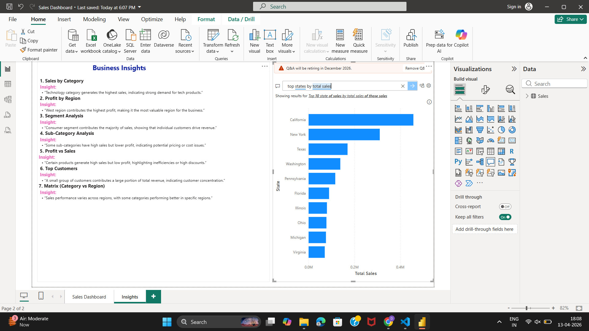

## 📊 Insights & Findings

### 🔹 Sales Performance
- The West region generated the highest sales compared to other regions.
- Technology category contributed the most to total revenue.

### 🔹 Profit Analysis
- Some products have high sales but low or negative profit due to heavy discounts.
- Furniture category shows lower profit margins compared to others.

### 🔹 Customer Behavior
- A small group of customers contributes to a large portion of total sales.
- Repeat customers show higher average purchase value.

### 🔹 Inventory Insights
- Certain products frequently go out of stock, indicating demand-supply mismatch.
- Low stock items need better inventory planning.

### 🔹 Business Recommendations
- Reduce discounts on low-profit products.
- Focus marketing on high-value customers.
- Improve stock management for fast-selling products.

## 📊 Insights Dashboard

